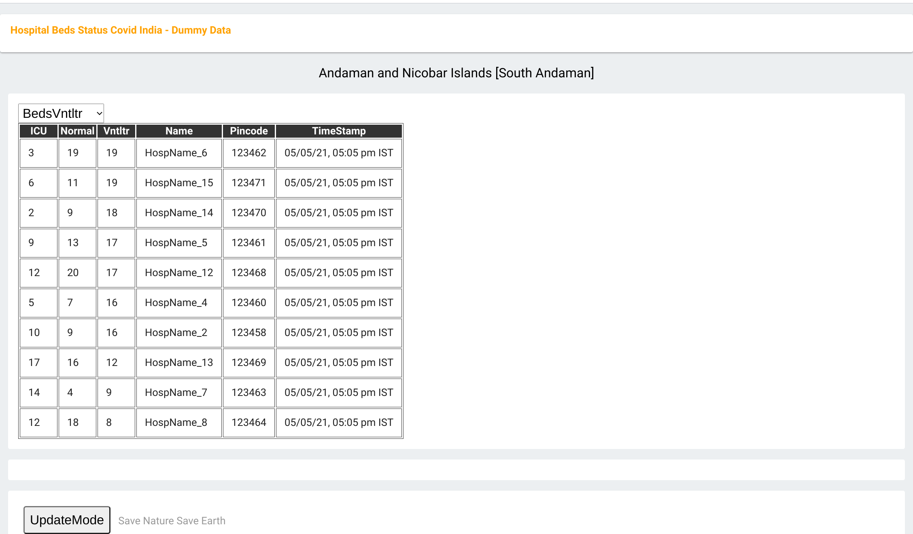

#######################################
A Online Hospital Beds+ status system
#######################################
Author: HanishKVC
Version: 20210502IST1822

Overview
###########

This is a keep it simple online hospital beds+ status system, where the hospitals are
grouped into states and inturn districts. One can look at the status of availability
of the tracked type of resources wrt the hospitals.

People view
=============

Users select the state followed by the district for which they want to know the status.
Inturn the system will show upto N number of hospitals with highest availability wrt one
of the predefined set of parameters like normal/icu/ventilator beds, ... in that district.
The user can choose based on which parameter they want to see the list of hospitals.
Thus people can query the availability status wrt the predefined set of parameters,
and inturn the hospitals in the selected state-district which have availability based
on selected parameter will be shown.

THe timestamp wrt when the data for any given hospital was last updated is also shown,
so that users can have a rough idea of how current the data may be wrt each hospital.

Any person can access the availability status maintained by the system, without needing
to login to the system.

NOTE: Microsoft IE is currently not supported, On windows one will have to use the newer
Microsoft Edge or Chrome or Firefox or ...

Data Owner's view
=====================

The system allows data owners to be assigned wrt the hospitals in the system.

The data owner is responsible for updating the availability status wrt the hospitals
for which they are assigned as the admins, at periodic intervals.

Initially the admin/data owner needs to create a sign in account in the system.
Inturn the central team managing the system need to cross verify the credentials of
the admin/data owner and inturn assign them as the admins for the needed set of
hospitals.

    Each hospital can have a single administrator.

    Each administrator could be data owner for more than 1 hospital.

    When a new user sign's into the system, a verification email is sent to the
    specified email, to validate the same. The user needs to complete the verification.
    In future the store rules will be updated to cross check that the admin user
    has a verified email.

The data owner needs to login to the system and inturn periodically update the availability
status wrt the parameters being tracked in the system. As the data owner updates the data,
the system will automatically update the time stamp wrt the corresponding hospital.

    Once a admin logs into the system, it will show all the hospitals to which they are
    the admin. Inturn it gives the option to update the availability status wrt all the
    hospitals from a single view.

    Once the admin has updated availability data wrt any of the hospital. They need to
    click on the corresponding sync button to trigger the same to be updated to the
    system's backend.

    The sync button associated with each hospital is color coded to indicate, the status
    of the last update/sync operation triggered wrt that hospital. So they can know, if
    they need to trigger the sync again or not.

        Gray/DefaultColor: Sync has not yet been triggered for the hospital.

        Blue: A sync has been triggered, and is in process.

        Red: The sync operation has failed. (User can press sync button to try again).

        Green: The sync operation has succeeded.

        NOTE: Moving away from the page will clear the color coding.

    NOTE: If one has modified data wrongly and has not yet synced it to the server, one
    can press the UpdateMode button and the logic will refresh the data in the shown table
    to what is stored in the system. Inturn the data owner can change/update to the needed
    value and press sync button to sync it to the backend server.

Developer view
===============

General
---------

This is a online system built on top of a cloud based NoSql database as the backend, and
html+javascript as the front end. Thus is inturn implemented as a serverless system, thus
not requiring any micro managing of server. The backed system selected allows the system
to scale up or down as the load on the system increases or reduces.

Google Firebase firestore is used as the NoSQL backend. It allows access control rules to
be defined wrt the different set of records maintained in it. This inturn allows the system
to be built without requiring any additional backend logic in this particular situation.

If possible (logistically speaking, wrt getting the required data from the hospitals) as one
may want to add additional parameters wrt the hospital to be maintained and inturn shown to
the end users of the system, the NoSQL allows the schema to evolve as and when required.

    Few such additional parameters could be

        Oxygen availability (may be normalised per Bed).

        ...

It is relatively easy to add such additional fields to the system.

Additionally firebase auth is used to simplify the authorisation system while also keeping
it secure. Also firebase hosting is used to distribute the small set of html+js files.

Admin scripts are used to

    initialise the database wrt the states/uts and their districts/regions, as well as
    the hospitals in the system.

    assign administrators to hospitals.

    Firebase-Admin sdk is used to build these admin scripts.

The state/uts/districts/regions info even thou available in the database, is not directly
picked from it, but instead picked from a json file maintained on the hosting server. Thus
avoiding unnecessary eating into the data base queries quota, but instead chipping into the
hosting quota, which should be fine, as nothing else is hosted other than the html+js files.

ToRefine
----------

If for some reason the logic is not able to retrieve data within a predefined time, then
under some circumstances we show a message at the bottom to alert the user to the same
and asking them to check internet connection and or ... This needs to be updated to also
trap internally acknowledged failures at db bridge level and show same or more appropriate
message. FOR NOW if user doesnt see any data, then they will mostly try reloading the page
and that should take care of things at one level.

Duplication
------------

If anyone finds this logic/system useful, feel free to duplicate it and customise it for
your specific use case. This is released under GPL.

When doing the same, as part of the same, at a minimum you will need to

    replace the project id in .firebaserc with the one you created for yourself.

    download the service account token for your project and store in a safe place
    and update the environment variable in setup-env.sh appropriately. This is
    need for using the firebase-admin sdk and inturn the admin scripts which I
    have done.

System administrator view
=============================

The system is administered using a set of admin commands to a admin script.

General flow
-------------

On a admin system (which could even be a local (non cloud) machine) the service account token
for the system is maintained. Inturn the admin script in the Firebase.Admin/HBCINAdmin folder
is run to manage the system. Ensure that the service account token is stored securely and not
uploaded to source control system or so.

Update the path in setup-env.sh shell script and run source setup-env.sh to make the same
available to the admin script.

To create a test dataset containing the states/uts and districts/regions of india along
with a randomly generated set of hospitals data, run

    node index.js create_testdata

To create a test admin user using which one can look at updating hospital bed availabiity
status, one needs to do the following.

    Create a user called test@india.world in the SignIn UI of the WebApp.

    Next run the following to set the email verified flag for this dummy email id

        node index.js enable_testadmin

    Then use import_hospadmins to enable test@india.world as the data owner for few of the
    hospitals in the system. Its assumed that you have created a sample admins file called
    sample.admins.json within the subfolder called config, wrt pwd/cur directory.

        node index.js import_hospadmins ./config/sample.admins.json

To create a actual dataset for deployment, one could use the default regions data, which
is already there for India, or create a new statesuts_districts.json file. Inturn create
the json file containing hospitals data and the json file containing the hospital admins
data and then run

    node index.js create_regions

    node index.js import_hospitals ./config/hospitals.vDate.json

    node index.js import_hospadmins ./config/hospital.admins.vDate.json

    NOTE: In the above example, it is assumed that the hospitals and their admin details
    is stored in a folder called config, with in the folder containing admin script.

    NOTE: The hospitals and their data owners/admins data is maintained as simple textual
    json files, so that it is simple to manage it and track it when updating and or later
    using simple text related tools.

    NOTE: It is not necessary to run all these commands at the same time, it can be run
    at seperate times. If one is changing the admin and or adding new hospitals to the
    system. New hospitals.json can be created which contains only details for the new
    hospitals and hospital.admins.json can be created with admin details for new hospitals
    as well as hospitals for which the admin is being changed. Inturn run the same
    import_hospitals/import_hospadmins command as before but with the new json files
    being passed to them.

    node index.js import_hospitals ./config/new.hospitals.vDate.json

    node index.js import_hospadmins ./config/updates.hospital.admins.vDate.json

    NOTE: As the hospitals data and the admins data will change very rarely, it is managed
    in a simple raw way, for now.

Hospitals
-----------

Generating Hospitals Json file
~~~~~~~~~~~~~~~~~~~~~~~~~~~~~~~~

The GenHospDataTool/generate_statesuts_hosps.py helper script can allow one to create the
states/uts/districts/regions json file, as well as the hospitals json file. These inturn
can be imported into the system using create_regions and import_hospitals command to the
admin script.

This script uses the hospitals directory data file from data.gov.in to generate the json
files. One needs to manually download the hospitals directory data file into a folder and
inturn run the generate script from that folder.

This helper script generates hospitals json file to match the data schema of the hospitals
collection and its hospital documents, as used by this system.

The Schema
~~~~~~~~~~~~

::

    {
        "HOSPID1": {
            'Name': "Hospital Name1",
            'PinCode': PINCODE,
            'StateId': STATE_ID,
            'DistrictId': DISTRICT_ID,
            'BedsICU': ICUBEDS_FREE,
            'BedsNormal': NORMALBEDS_FREE,
            'BedsVntltr': VENTILATORS_FREE
            },
        "HOSPID2": {
            'Name': "Hospital Name2",
            'PinCode': PINCODE,
            'StateId': STATE_ID,
            'DistrictId': DISTRICT_ID,
            'BedsICU': ICUBEDS_FREE,
            'BedsNormal': NORMALBEDS_FREE,
            'BedsVntltr': VENTILATORS_FREE
            },
        ...,
        "HOSPIDN": {
            'Name': "Hospital NameN",
            'PinCode': PINCODE,
            'StateId': STATE_ID,
            'DistrictId': DISTRICT_ID,
            'BedsICU': ICUBEDS_FREE,
            'BedsNormal': NORMALBEDS_FREE,
            'BedsVntltr': VENTILATORS_FREE
            }
    }

import_hospitals
~~~~~~~~~~~~~~~~~~~

node index.js import_hospitals path/to/hospitals.json [--mode=<Normal|TEST>] [--start=<Number>]

This is the command to import hospitals json file (following the above mentioned schema)
into the system. It sets the timestamp field automatically in a suitable way. By default
this means using the server timestamp currently.

It supports two optional arguments

--mode=Normal

    Allow the command to run in normal mode, in which case the hospitals data is
    duplicated as it exists in the json file.

--mode=TEST

    Run the command in TEST mode, in which case the beds availability data is
    randomly generated, ignoring any value already specified in the json file.

    This is useful for testing without having to specify different values for
    different hospitals wrt different bed types.

--start=N

    Skip N hospital records from the begining of the hospitals json file and
    import the remaining hospitals.

However if one is using the import_collection command, then even the timestamp field needs
to be part of the json file.

Hospital DataOwners/Admins
----------------------------

One can import hospital admins by using either the import_hospadmins helper command or by
using the generic import_collection command.

It is recommended to use the import_hospadmins command in general.

NOTE that in either case the json file requires to be a valid json file, with no ',' wrt
end of last record.

Using import_hospadmins
~~~~~~~~~~~~~~~~~~~~~~~~~

The corresponding command is

    node index.js import_hospadmins ./config/hospital.admins.vDate.json

If using the import_hospadmins command, then the json file passed needs to follow a simple
json structure of

::

    {
        "HOSPID1": adminEmailId,
        "HOSPID2": adminEmailId,
        ...,
        "HOSPIDN": adminEmailId
    }

Here one needs to use the admin's emailId and the logic will inturn cross check to verify
if the specified adminEmilId is registered with the system or not. If not registered, then
the corresponding hospital's admin id if any wont be changed.

On the other hand, if the email id is found in the system's auth database, then it is checked
as to whether the hospital admin (data owner) has got their email verified with the auth system
or not. If email is already verified, then the related hospital's admin record is updated to
reflect that user as the admin, else a dummy invalid auth id is written into corresponding
hospital's admin record, so that no one else can edit that hospital's record. And the admin
needs to get their email id verified with the system at the earliest, so that they get access
to udpate the resource availability data wrt the hospital.

In all of these 3 cases, a message is also logged to the console.

Using import_collection
~~~~~~~~~~~~~~~~~~~~~~~~~

The command is

    node index.js import_collection HospitalsExtra ./config/hospital.admins.vDate.json

If the import_collection command is used, then the json file requires to reflect the
HospitalsExtra collection's data schema. i.e

::

    {
        "HOSPID1": {
            'AdminId': adminUid
            },
        "HOSPID2": {
            'AdminId': adminUid
            },
        ...,
        "HOSPIDN": {
            'AdminId': adminUid
            }
    }

In this case, the admin's uid needs to be specified in the json file. The import_collection
logic doesnt try to validate anything, it will blindly update the corresponding document
in the systems' backend database.

import_collection
-------------------

This is a generic command available for importing a simple collection of documents (firestore
speak), into the backend firestore database.

It doesnt try to validate anything, but instead just does a blind transfer into the server.

Even thou import_hospitals is the recommended way to import hospital details into the system,
one could still use import_collection to import the data and avoid the additional cost if any
associated with server.TimeStamping (vaguely remembering reading somewhere on google site that
there is a additional cost associated with server timestamping, which seemed bit odd, and I am
not able to get that online page again now). However in this case you will be filling the time
stamp yourself with what ever value you choose.

General Note
==============

Reloading the page will reset the app to main screen and the user will have to login again,
if they are data owners/hospital admins.

History
=========

Given some of the issues faced by people during the covid pandemic 2nd wave recently, there
was a discussion online if a system could be developed to help with some of the issues like
knowing the availability status wrt beds and so. So I thought of creating this as a small
way of doing something hopefully positive. This could either be used as such by duplicating
it, and or with modifications as people find fit to their needs, and or as some initial
thoughts for ones own experimentation.

This is something which has been created over a 3-5 day period, with minimal previous experimenting
wrt html and javascript, as well as first time use of cloud from my end. I have done quick glances
at docs based on need, as I went about developing this. So do take this with a pinch of salt, as it
may not follow the usual conventions used by developers in these domains. However hopefully here
is a simple yet working system, using the cloud resources available to get it up and running in a
scalable way in a very short time.

At the same time one needs to keep the costing of clouds in mind when working with the cloud. For
this current system, which was needed to come up on short notice and be able to scale massively
potentially if required, while at the same time being needed for a relatively short period of time
only, cloud makes sense. Else one may need to think twice before going with a purely cloud based
system.

Things to cross check
=======================

JavaScript modules
--------------------

The logic has been implemented by avoiding use of any front end related js or any other
web related modules. Only firebase modules are used to provide the cloud support.
Currently the firebase modules dont support a newer javascript modular mechanisms.
So the full library needs to be pulled in, whether all of it is used or only some
parts are used.

    This has the side effect of impacting the initial load time wrt the webpage for the
    1st time and some of the inbetween visits wrt any/each individual user to the site.
    As also having a higher hosting load and cost.

    If hosting site uses/supports gzip before/wrt transfering things, the -ve impact
    will be lesser.

Also google is in the process of moving to a fully modular and choppable version of firebase,
which has entered beta recently, once it has a stable release, it should be relatively easy
to switch to the same and that should help optimise things wrt size, load and cost.

The core logic and the states/uts/districts data together take around 60KB. While the firebase
modules together take around 900KB. These are raw figures, gzip should help matters a bit here.

Cloud cost
-----------

A initial take at a very very rough dumb calculation of the Google cloud costing assuming

    ~50 Lakh users per day (i.e around 15 Crore people in a month) using the site

    and around 1000 data owners updating details of about 10K hospitals
    multiple times in a day.

    seems to indicate a monthly google cloud cost of around ~10 Lakh Rs (12K$).

    I need to think through as well as cross check my calculations again as well as
    run the numbers through google's cloud team to cross check that I am not
    misinterpreting their costing mechanism and or goofing up my calculation anywhere.

    NOTE: This is the first time I am looking at public cloud. Also I havent reviewed
    my initial take at the costing yet, SO there is a high probability that I might have
    messed up my calculations and or misinterpreted costing mechanisms of the cloud
    infrastructure provider. At the same time, I am putting this here, so that anyone
    looking into this is not working blind, but has some estimate (good or bad).

I have included the csv file which I did to make this initial guess of cloud costing with
this repo.

On a parallel/side note, If someone wants to use such a system in a small closed setup/group,
where they use such a system to distribute/share info from across a wide geographic area
in a controlled and fast manner and then inturn share the data with general public using other
mechanisms, then one may be able to take advantage of the free tier provided by Google/Firebase
and keep the running cost very low. However if one is opening up the system for general public
use, then the loading and its cost implications need to be thought through bit more carefully
and then the decision taken.

Screens
##########

.. image:: Notes/Images/HBCIn_Main.png
   :alt: The Main screen

The Main screen

.. image:: Notes/Images/HBCIn_StateLvl1.png
   :alt: State Lvl screen

State level screen

.. image:: Notes/Images/HBCIn_DistrictLvl1.png
   :alt: District Lvl screen - filter and sort on BedsNormal

District level screen - Filter-Sort on BedsNormal

District level screen - Filter-Sort on BedsVentilator

.. image:: Notes/Images/HBCIn_UpdateModeSignIn.png
   :alt: UpdateMode SignIn screen

UpdateMode signin screen

UpdateMode update availability screen

.. image:: Notes/Images/HBCIn_StateLvl2.png
   :alt: State Lvl screen - signed in

State level screen (signed in - shows user email)

At the End
############

Save Nature Save Earth.

Vasudhaiva Kutumbakam.

Lets all be responsible in life and work towards the good of all.

.. vim: set sts=4 ts=4 expandtab: ..
