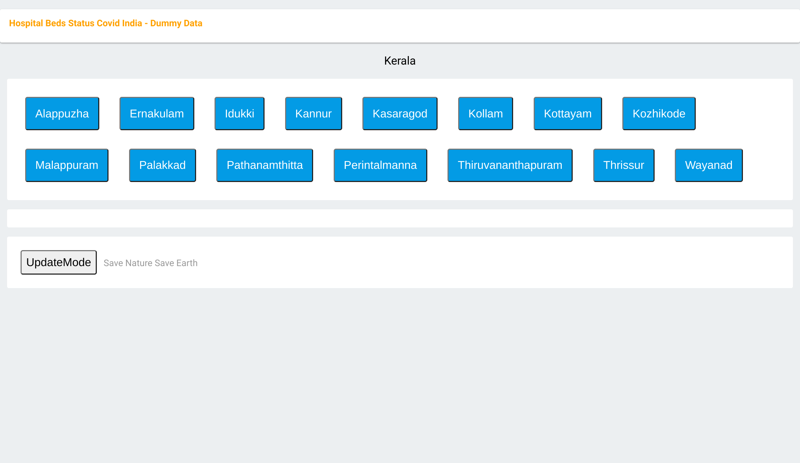
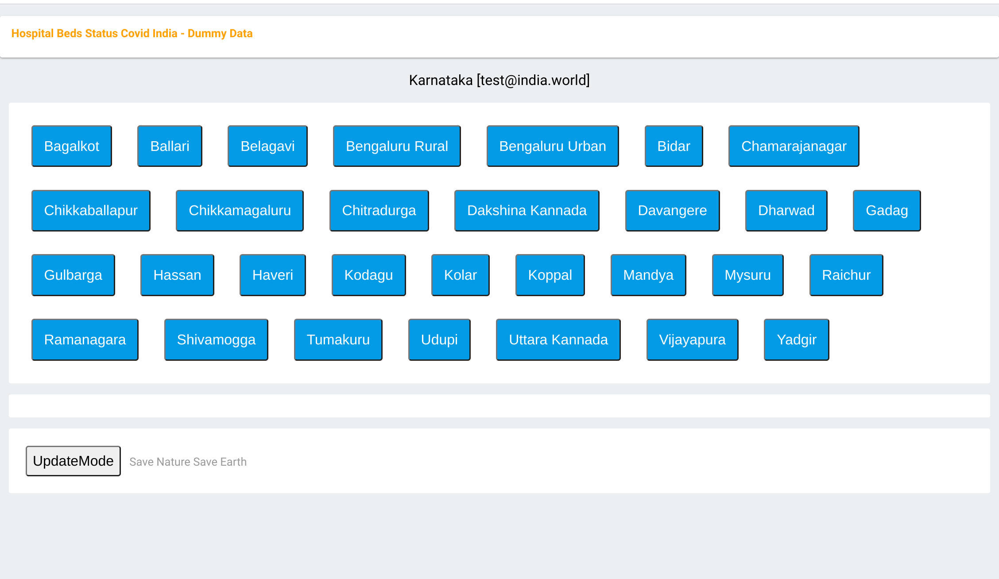

#######################################
A Online Hospital Beds+ status system
#######################################
Author: HanishKVC
Version: 20210502IST1822

Overview
###########

This is a keep it simple online hospital beds+ status system, where the hospitals are
grouped into states and inturn districts. One can look at the status of availability
of the tracked type of resources wrt the hospitals.

People view
=============

Users select the state followed by the district for which they want to know the status.
Inturn the system will show upto N number of hospitals with highest availability wrt one
of the predefined set of parameters like normal/icu/ventilator beds, ... in that district.
The user can choose based on which parameter they want to see the list of hospitals.
Thus people can query the availability status wrt the predefined set of parameters,
and inturn the hospitals in the selected state-district which have availability based
on selected parameter will be shown.

THe timestamp wrt when the data for any given hospital was last updated is also shown,
so that users can have a rough idea of how current the data may be wrt each hospital.

Any person can access the availability status maintained by the system, without needing
to login to the system.

Data Owner's view
=====================

The system allows data owners to be assigned wrt the hospitals in the system.

The data owner is responsible for updating the availability status wrt the hospitals
for which they are assigned as the admins, at periodic intervals.

Initially the admin/data owner needs to create a sign in account in the system.
Inturn the central team managing the system need to cross verify the credentials of
the admin/data owner and inturn assign them as the admins for the needed set of
hospitals.

    Each hospital can have a single administrator.

    Each administrator could be data owner for more than 1 hospital.

    When a new user sign's into the system, a verification email is sent to the
    specified email, to validate the same. The user needs to complete the verification.
    In future the store rules will be updated to cross check that the admin user
    has a verified email.

The data owner needs to login to the system and inturn periodically update the availability
status wrt the parameters being tracked in the system. As the data owner updates the data,
the system will automatically update the time stamp wrt the corresponding hospital.

    Once a admin logs into the system, it will show all the hospitals to which they are
    the admin. Inturn it gives the option to update the availability status wrt all the
    hospitals from a single view.

    Once the admin has updated availability data wrt any of the hospital. They need to
    click on the corresponding sync button to trigger the same to be updated to the
    system's backend.

    The sync button associated with each hospital is color coded to indicate, the status
    of the last update/sync operation triggered wrt that hospital. So they can know, if
    they need to trigger the sync again or not.

        Gray/DefaultColor: Sync has not yet been triggered for the hospital.

        Blue: A sync has been triggered, and is in process.

        Red: The sync operation has failed. (User can press sync button to try again).

        Green: The sync operation has succeeded.

        NOTE: Moving away from the page will clear the color coding.

    NOTE: If one has modified data wrongly and has not yet synced it to the server, one
    can press the UpdateMode button and the logic will refresh the data in the shown table
    to what is stored in the system. Inturn the data owner can change/update to the needed
    value and press sync button to sync it to the backend server.

Developer view
===============

This is a online system built on top of a cloud based NoSql database as the backend, and
html+javascript as the front end. Thus is inturn implemented as a serverless system, thus
not requiring any micro managing of server. The backed system selected allows the system
to scale up or down as the load on the system increases or reduces.

Google Firebase firestore is used as the NoSQL backend. It allows access control rules to
be defined wrt the different set of records maintained in it. This inturn allows the system
to be built without requiring any additional backend logic in this particular situation.

If possible (logistically speaking, wrt getting the required data from the hospitals) as one
may want to add additional parameters wrt the hospital to be maintained and inturn shown to
the end users of the system, the NoSQL allows the schema to evolve as and when required.

    Few such additional parameters could be

        Oxygen availability (may be normalised per Bed).

        ...

It is relatively easy to add such additional fields to the system.

Additionally firebase auth is used to simplify the authorisation system while also keeping
it secure. Also firebase hosting is used to distribute the small set of html+js files.

Admin scripts are used to

    initialise the database wrt the states/uts and their districts/regions, as well as
    the hospitals in the system.

    assign administrators to hospitals. [ToDo]

    Firebase-Admin sdk is used to build these admin scripts.

The state/uts/districts/regions info even thou available in the database, is not directly
picked from it, but instead picked from a json file maintained on the hosting server. Thus
avoiding unnecessary eating into the data base queries quota, but instead chipping into the
hosting quota, which should be fine, as nothing else is hosted other than the html+js files.

General Note
==============

Reloading the page will reset the app to main screen and the user will have to login again,
if they are data owners/hospital admins.

History
=========

Given some of the issues faced by people during the covid pandemic 2nd wave recently, there
was a discussion online if a system could be developed to help with some of the issues like
knowing the availability status wrt beds and so. So I thought of creating this as a small
way of doing something hopefully positive. This could either be used as such by duplicating
it, and or with modifications as people find fit to their needs, and or as some initial
thoughts for ones own experimentation.

This is something which has been created over a 3-5 day period, with minimal previous experimenting
wrt html and javascript, as well as first time use of cloud from my end. I have done quick glances
at docs based on need, as I went about developing this. So do take this with a pinch of salt, as it
may not follow the usual conventions used by developers in these domains. However hopefully here
is a simple yet working system, using the cloud resources available to get it up and running in a
scalable way in a very short time.

At the same time one needs to keep the costing of clouds in mind when working with the cloud. For
this current system, which was needed to come up on short notice and be able to scale massively
potentially if required, while at the same time being needed for a relatively short period of time
only, cloud makes sense. Else one may need to think twice before going with a purely cloud based
system.

Things to cross check
=======================

Cloud cost
-----------

A initial take at a very very rough dumb calculation of the Google cloud costing assuming

    ~50 Lakh users per day (i.e around 15 Crore people in a month) using the site

    and around 1000 data owners updating details of about 10K hospitals
    multiple times in a day.

    seems to indicate a monthly google cloud cost of around ~10 Lakh Rs (12K$).

    I need to think through as well as cross check my calculations again as well as
    run the numbers through google's cloud team to cross check that I am not
    misinterpreting their costing mechanism and or goofing up my calculation anywhere.

    NOTE: This is the first time I am looking at public cloud. Also I havent reviewed
    my initial take at the costing yet, SO there is a high probability that I might have
    messed up my calculations and or misinterpreted costing mechanisms of the cloud
    infrastructure provider. At the same time, I am putting this here, so that anyone
    looking into this is not working blind, but has some estimate (good or bad).

Screens
##########

The Main screen

State level screen

District level screen - Filter on BedsICU

.. image:: Notes/Images/HBCIn_DistrictLvl2.png
   :alt: District Lvl screen - filter on BedsVntltr

District level screen - Filter on BedsVntltr

UpdateMode signin screen

.. image:: Notes/Images/HBCIn_UpdateModeUpdate.png
   :alt: UpdateMode Update screen

UpdateMode update screen

State level screen (signed in)

At the End
############

Save Nature Save Earth.

Vasudhaiva Kutumbakam.

Lets all be responsible in life and work towards the good of all.

